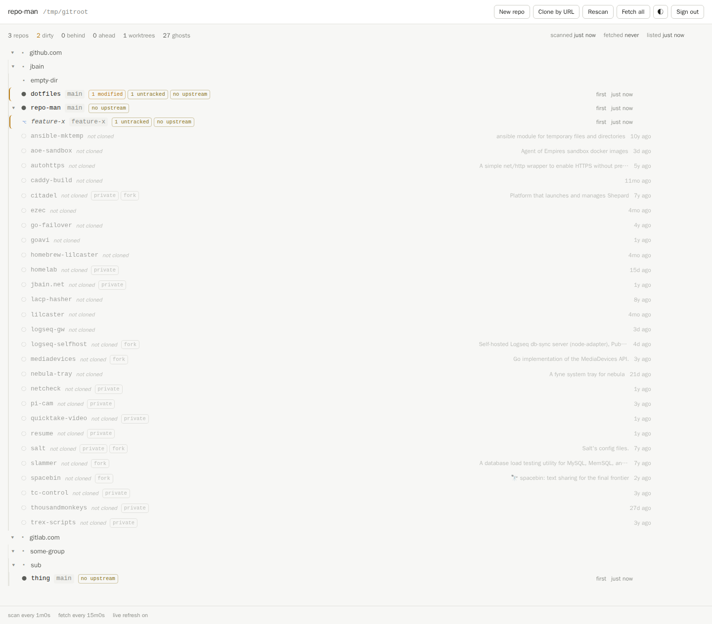

# repo-man

A web dashboard for the git repositories you have checked out locally.



It assumes the Go-style layout — every checkout under one root, keyed by its
origin:

```
~/git/github.com/jbain/repo-man/                     primary checkout
~/git/github.com/jbain/repo-man-worktrees/feature-x/ linked worktree
~/git/gitlab.com/some-group/sub-group/thing/         providers nest freely
```

and shows it as a tree with per-repository git status: uncommitted changes,
ahead/behind origin, detached HEAD, conflicts, stashes. Worktrees hang off
their primary checkout with the same status indicators and a distinct look.
Under a configured account directory it also lists the repositories you have
on GitHub but have *not* cloned, greyed out, with a one-click clone.

Beyond looking, it does exactly three things: create a directory and `git init`
it, clone one of your own repositories, and clone any repository by URL. It
never modifies, moves, or deletes an existing checkout.

## Running it

```
go build -o repoman ./cmd/repoman
REPOMAN_PASSPHRASE='...' ./repoman -root ~/git -owners github.com/jbain
```

Or with Docker — see [Deployment](#deployment).

### Configuration

Every setting has a flag and an environment variable; flags win. The
passphrase is environment-only, because a flag value is visible to every user
on the machine via the process table.

| Flag | Environment | Default | Meaning |
| --- | --- | --- | --- |
| `-root` | `REPOMAN_ROOT` | `~/git` | Root directory holding all checkouts |
| `-addr` | `REPOMAN_ADDR` | `127.0.0.1:8464` | Listen address |
| `-owners` | `REPOMAN_OWNERS` | *(none)* | Comma-separated accounts to list repos for, e.g. `github.com/jbain,github.com/some-org`. A bare name means github.com |
| — | `REPOMAN_PASSPHRASE` | *(none)* | Passphrase gating the UI. Empty disables authentication |
| `-secure-cookie` | `REPOMAN_SECURE_COOKIE` | `false` | Mark the session cookie `Secure` (set when TLS terminates upstream) |
| `-trust-proxy-ip` | `REPOMAN_TRUST_PROXY_IP` | `false` | Attribute login rate limiting to `X-Forwarded-For` |
| `-scan-interval` | `REPOMAN_SCAN_INTERVAL` | `60s` | How often to re-walk the filesystem |
| `-fetch-interval` | `REPOMAN_FETCH_INTERVAL` | `15m` | How often to refresh remote refs. `0` disables background fetching |
| `-github-interval` | `REPOMAN_GITHUB_INTERVAL` | `30m` | How often to refresh provider repo listings |
| `-fetch-concurrency` | `REPOMAN_FETCH_CONCURRENCY` | `4` | Simultaneous `git fetch` processes |
| `-fetch-timeout` | `REPOMAN_FETCH_TIMEOUT` | `60s` | Timeout for a single fetch |
| `-max-depth` | `REPOMAN_MAX_DEPTH` | `8` | How deep below the root to search |
| — | `REPOMAN_LOG_LEVEL` | `info` | `debug`, `info`, `warn`, `error` |

Listing un-cloned repositories needs the `gh` CLI on `PATH` and authenticated
(a read-only token is enough). Without it the dashboard still shows every local
checkout; it just cannot show what you have not cloned.

## How it works

Three loops, no stored state:

- **Scan** (every 60s) walks the root, stops descending the moment it sees a
  `.git`, and runs one `git status --porcelain=v2 --branch` per checkout with
  bounded concurrency. `GIT_OPTIONAL_LOCKS=0` keeps this polling from ever
  taking the index lock out from under your own git commands.
- **Fetch** (every 15m) refreshes remote-tracking refs so "behind origin" means
  something. It only fetches *primary* checkouts: worktrees share the object
  store and remote refs, so fetching them would repeat identical network work.
  This is the only loop that touches the network. A per-repo refresh button
  fetches on demand.
- **List** (every 30m) reloads each configured account's repository list
  through `gh`. A failed refresh keeps serving the previous list rather than
  making every un-cloned repository vanish because a token expired.

Each scan builds a fresh tree and swaps it in atomically, so readers never see
a half-built one. Nothing is written to disk: no database, no cache files, no
session store. A restart costs one re-login and one scan.

Worktrees are detected by their `.git` *file* and its `gitdir:` pointer, not by
the `-worktrees` directory name — the naming convention is just where you
happen to park them, so one parked elsewhere is still identified correctly. In
the tree they are re-parented onto their primary checkout, and the emptied
`-worktrees` directory is pruned away.

A repository counts as "already cloned" if any checkout under the root has it
as `origin`, not merely if something sits at the conventional path. Clone
`dotfiles` into a directory named something else and it still won't show up as
a ghost.

## Security

Single tenant, meant to sit behind a VPN and a reverse proxy that terminates
TLS. The model is deliberately small:

- One pre-shared passphrase, compared in constant time. No accounts, no roles.
- A random 32-byte session id in an `HttpOnly; SameSite=Strict` cookie, with a
  sliding 30-day expiry. Sessions live in memory only.
- Per-IP login rate limiting: 5 failures in 15 minutes trips a 15-minute
  lockout. Failures within 500ms of each other coalesce, so one page load's
  parallel requests cannot burn the budget, while a serial brute-forcer still
  locks out in seconds.
- A strict `Content-Security-Policy`: the page loads no scripts, styles, fonts,
  or images from anywhere but itself.
- Every request path is confined to the root before it reaches the filesystem,
  with `..`, NUL bytes, symlink escapes, and leading-dash path elements
  rejected. The last one matters because these become git arguments: a
  directory named `--upload-pack=...` would otherwise be parsed as a flag.
- Clone URLs are validated before reaching git. `ext::` URLs — which execute
  arbitrary commands — are rejected, and `protocol.ext.allow=never` is passed
  on every network operation as a second layer.

Deliberately *not* implemented, because they add friction or dependencies
without strengthening this threat model: argon2 hashing of a passphrase that
already lives in the process environment, client-side device binding, step-up
re-authentication, and on-disk session persistence.

If `REPOMAN_PASSPHRASE` is unset the service logs a warning and serves
unauthenticated. That is only reasonable if something else is in front of it.

## Deployment

```sh
cp .env.example .env
# fill in REPOMAN_PASSPHRASE, REPO_ROOT, UID/GID, GH_TOKEN
docker compose up -d --build
```

The image carries `git`, `gh`, and an ssh client, because the service drives
those binaries rather than reimplementing them. Set `UID`/`GID` to the host
user that owns your checkout tree — otherwise clones land with the wrong
ownership. The compose file publishes on `127.0.0.1` only; put your proxy in
front of that.

## Development

```sh
go test ./...          # unit tests plus real-git integration tests
go test -race ./...
go vet ./...
gofmt -l .
```

Tests that need git skip themselves when it is missing, and the GitHub tests
use a fake `gh` binary rather than the network. There is one live-API test,
skipped unless `REPOMAN_GITHUB_LIVE_TEST=1`.

### Layout

```
cmd/repoman/        wiring, flags, graceful shutdown
internal/model/     shared types — the contract between every other package
internal/config/    flags and environment
internal/safepath/  confining user-supplied paths to the root
internal/scan/      the filesystem walk
internal/git/       every git subprocess: status, fetch, init, clone, URL parsing
internal/github/    repository listings via the gh CLI
internal/tree/      assembling scan + status + listings into the display tree
internal/index/     the collection loops and the published snapshot
internal/jobs/      background clone tracking
internal/actions/   the write surface: init and clone
internal/auth/      passphrase, sessions, rate limiting
internal/web/       handlers, templates, embedded assets
```

There are no third-party dependencies, and the intent is to keep it that way.
